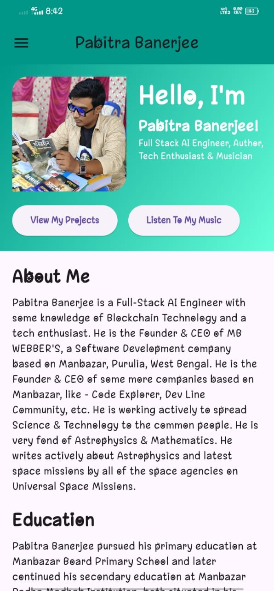
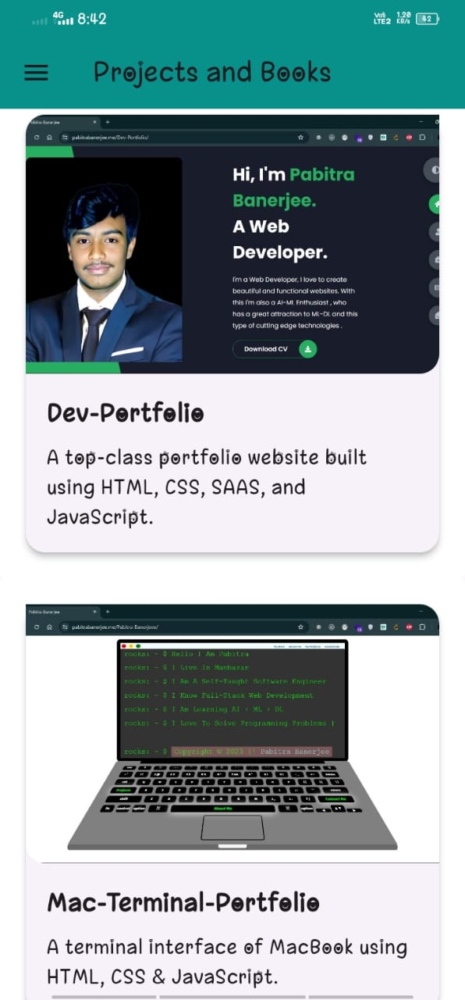

# Pabitra Banerjee Android Application

Welcome to my personal portfolio app built using Flutter! This app showcases my projects, books, and professional achievements. Explore my work, learn about my background, and connect with me on various social media platforms.

## Table of Contents

- [Features](#features)
- [Installation](#installation)
- [Usage](#usage)
- [Project Structure](#project-structure)
- [Screenshots](#screenshots)
- [Contributing](#contributing)
- [License](#license)
- [Contact](#contact)

## Features

- Home page with personal introduction and navigation
- List of development projects and books
- Detailed view for each project and book
- Social media links for easy connection
- Smooth transitions and animations
- Responsive design

## Installation

To run this project locally, follow these steps:

1. **Clone the repository:**

   ```bash
   git clone https://github.com/PB2204/Pabitra-Banerjee-Android-Application.git
   cd Pabitra-Banerjee-Android-Application
   ```

2. **Install dependencies:**

   ```bash
   flutter pub get
   ```

3. **Run the app:**

   ```bash
   flutter run
   ```

## Usage

- **Home Page:** Navigate through different sections such as About Me, Education, Projects, Programming Projects, VS Marketplace, PyConda, Books, and Recognition.
- **Projects Page:** View a list of projects and books. Click on any item to see detailed information.
- **Project Detail Page:** Provides a detailed description of the selected project, including links to GitHub and live versions (if available).
- **Social Media Links:** Connect with me on GitHub, LinkedIn, Twitter, Instagram, Google, and Spotify.

## Project Structure

```
my_portfolio/
├── android/
├── ios/
├── lib/
│   ├── widgets/
│   │   └── social_media_links.dart
│   ├── main.dart
│   ├── home_page.dart
│   ├── projects_page.dart
│   └── project_details_page.dart
├── test/
├── images/
│   ├── hero.jpg
│   ├── icon.png
│   ├── dev_portfolio.jpg
│   ├── mac_terminal_portfolio.jpg
│   ├── book_finder_app.jpg
│   ├── clash_of_space.jpg
│   ├── mb_health_bot.png
│   ├── beyond_bits_and_bytes.jpg
│   ├── novice_to_ninja.jpg
│   ├── decoding_ai.jpg
│   ├── python_guide.jpg
│   ├── marvels_of_cosmos.jpg
│   ├── loves_victory.jpg
│   ├── bits_and_bytes.jpg
│   ├── dsa_cpp.png
│   ├── decoding_ai.png
│   ├── python3_the_essential_guide.png
│   ├── marvels_of_the_cosmos.png
│   └── lovesvictory.jpg
├── pubspec.yaml
└── .github/
    └── workflows/
        └── main.yml
```

## Screenshots





## Contributing

Contributions are welcome! If you have any suggestions or improvements, feel free to create an issue or submit a pull request.

1. **Fork the repository**
2. **Create your feature branch** (`git checkout -b feature/AmazingFeature`)
3. **Commit your changes** (`git commit -m 'Add some AmazingFeature'`)
4. **Push to the branch** (`git push origin feature/AmazingFeature`)
5. **Open a pull request**

## License

This project is licensed under the MIT License. See the [LICENSE](LICENSE) file for details.

## Contact

Pabitra Banerjee - [LinkedIn](https://linkedin.com/in/pabitra-banerjee) - [GitHub](https://github.com/PB2204)

Feel free to reach out if you have any questions or suggestions!